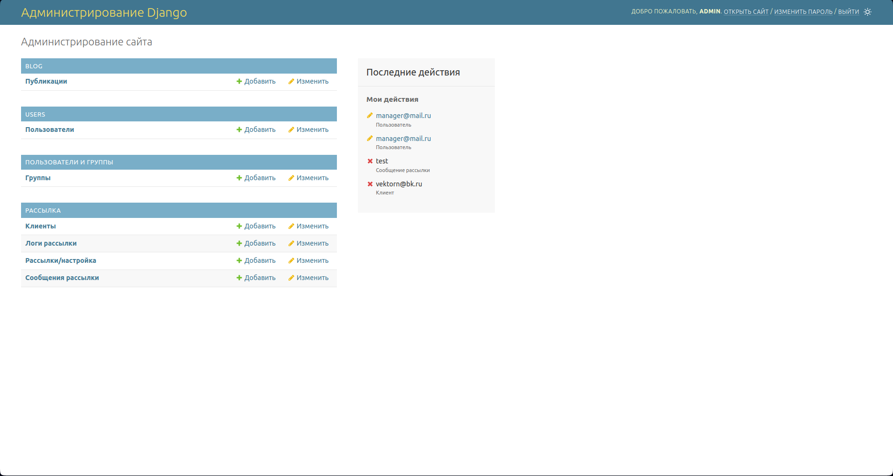

# **COURSE WORK № 4** 
Это проект, написанный на языках 

- Python
- HTML
- SQL
- JavaScript

с использованием фреймворка Django, служит как, сервис управления рассылками, администрирования и 
получения статистики.</p>


### **Установка**
Для установки проекта mailing_management_service, следуйте инструкциям ниже:

<p>1. Склонируйте репозиторий на своем компьютере:</p>

`git clone https://github.com/VictorVolkov7/mailing_management_service`

 <p>2. Перейдите в папку с проектом:</p>

`cd mailing_management_service`

<p>3. Создайте и активируйте виртуальное окружение:</p>

`poetry init`

`poetry shell`

<p>4. Установите зависимости проекта:</p>

`poetry install`

<p>5. Создайте файл .env в корневой папке проекта и заполните данные для настройки проекта:</p>

```ini
/.env/

DJANGO_SECRET_KEY=

DB_NAME=
PSQL_USER=
PSQL_PASS=

GMAIL_PASS=
GMAIL=username@gmail.com
EMAIL_USE_TLS=True/False
EMAIL_USE_SSL=True/False

SU_PASS=
SU_EMAIL=username@gmail.com

CACHE_LOCATION=
CACHE_ENABLE=True/False
```

<p>6. Примените миграции:</p>

`python manage.py migrate`

<p>7. Запустите сервер, создайте суперпользователя, а также активируйте крон-задачи:</p>

`python manage.py runserver` или запустите файл manage.py горячими клавишами или по кнопке 'RUN'

`python manage.py csu` создать суперпользователя

```ini
python manage.py crontab add` запуск крон-задач
python manage.py crontab show` показать текущие крон-задачи
python manage.py crontab remove` удалить крон-задачи
```


### **Использование**
После установки проекта mailing_management_service и запуска сервера. Вы сможете перейти на сайт 127.0.0.1 
(если сервер запущен локально), войти и начать пользоваться всей функциональностью данного проекта.

**Пользователь**


**Админ (superuser)**
Вход в админ режим осуществляется через 127.0.0.1/admin (если сервер запущен локально). Здесь представлен полный 
функционал администратора для работы с сайтом. 

Также на самом сайте есть полный доступ ко всем рассылкам и клиентам пользователей, также дополнительная вкладка со 
всеми пользователями сайта.


Также дополнительный функционал для бана пользователей.


Через админ панель django можно создать блог-менеджера (blog_manager) и менеджер (manger). 
Для этих групп функционал сайта настроен.


Группа пользователей (group_user) автоматически присваивается пользователям при регистрации

**Менеджер (manager)**

*Функционал менеджера похож на функционал админа*
- Может просматривать любые рассылки.
- Может просматривать список пользователей сервиса.
- Может блокировать пользователей сервиса.
- Может отключать рассылки.
- Не может редактировать рассылки.
- Не может изменять рассылки и сообщения.

*так же он не видит клиентов пользователя*

**Блог-менеджер (blog_manager)**

Весь основной функционал блог-менеджера реализован в админ-панели Django

На сайте ему лишь доступен просмотр новостной ленты для просмотра блог-записей


Автор
VictorVolkov7 - vectorn1212@gmail.com
